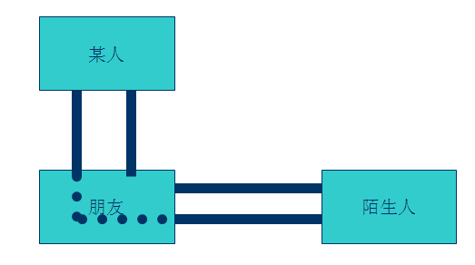
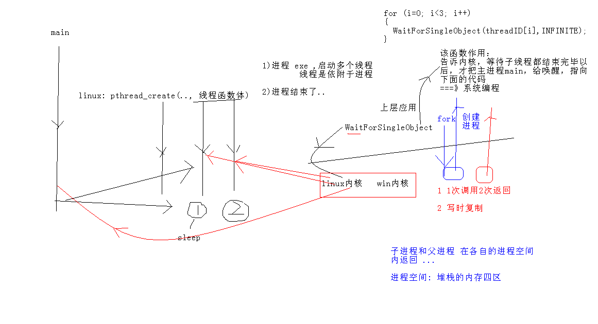

# DesignPatterns
# 设计模式基础
## 1 设计模式编程基础
### 1.1 设计模式前言
#### 模式
* 在一定环境中解决某一问题的方案，包括三个基本元素--问题，解决方案和环境。
* 大白话：在一定环境下，用固定套路解决问题。
#### 设计模式（Design pattern）
* 是一套被反复使用、多数人知晓的、经过分类编目的、代码设计经验的总结。使用设计模式是为了可重用代码、让代码更容易被他人理解、保证代 码可靠性。 毫无疑问，设计模式于己于他人于系统都是多赢的；设计模式使代码编制真正工程化；
* 设计模式是软件工程的基石脉络，如同大厦的结构一样。
#### 学习设计模式的意义
* 提高职业素养，关注学员在行业内的长期发展。
#### “我眼中的设计模式”
* 把简单的问题复杂化（标准化），把环境中的各个部分进行抽象、归纳、解耦合。
* 不是多神秘的东西，我们初学者也能学的会。要有信心。
#### 学习设计模式的方法
* 对初学者：
    * 积累案例，大于背类图。
* 初级开发人员：
    * 多思考、多梳理，归纳总结；
    * 尊重事物的认知规律，注意事物临界点的突破。不可浮躁。
* 中级开发人员
    * 合适的开发环境，寻找合适的设计模式，解决问题。
    * 多应用
    * 对经典组合设计模式的大量、自由的运用。要不断的追求。
#### 设计模式的分类
* Gang of Four的“Design Patterns: Elements of Resualbel Software”书将设计模式归纳为三大类型，共23种。
    * 创建型模式 :  通常和对象的创建有关，涉及到对象实例化的方式。（共5种模式)
    * 结构型模式： 描述的是如何组合类和对象以获得更大的结构。(共7种模式)
    * 行为型模式： 用来对类或对象怎样交互和怎样分配职责进行描述。(共11种模式)
#### 创建型模式用来处理对象的创建过程，主要包含以下5种设计模式：
* 1. 工厂方法模式（Factory Method Pattern）的用意是定义一个创建产品对象的工厂接口，将实际创建工作推迟到子类中。
* 2. 抽象工厂模式（Abstract Factory Pattern）的意图是提供一个创建一系列相关或者相互依赖的接口，而无需指定它们具体的类。
* 3. 建造者模式（Builder Pattern）的意图是将一个复杂的构建与其表示相分离，使得同样的构建过程可以创建不同的表示。
* 4. 原型模式（Prototype Pattern）是用原型实例指定创建对象的种类，并且通过拷贝这些原型创建新的对象。
* 5. 单例模式（Singleton Pattern）是保证一个类仅有一个实例，并提供一个访问它的全局访问点。
#### 结构型模式用来处理类或者对象的组合，主要包含以下7种设计模式：
* 6. 代理模式（Proxy Pattern）就是为其他对象提供一种代理以控制对这个对象的访问。
* 7. 装饰者模式（Decorator Pattern）动态的给一个对象添加一些额外的职责。就增加功能来说，此模式比生成子类更为灵活。 
* 8. 适配器模式（Adapter Pattern）是将一个类的接口转换成客户希望的另外一个接口。使得原本由于接口不兼容而不能一起工作的那些类可以一起工作。 
* 9. 桥接模式（Bridge Pattern）是将抽象部分与实际部分分离，使它们都可以独立的变化。
* 10. 组合模式（Composite Pattern）是将对象组合成树形结构以表示“部分--整体”的层次结构。使得用户对单个对象和组合对象的使用具有一致性。
* 11. 外观模式（Facade Pattern）是为子系统中的一组接口提供一个一致的界面，此模式定义了一个高层接口，这个接口使得这一子系统更加容易使用。
* 12. 享元模式（Flyweight Pattern）是以共享的方式高效的支持大量的细粒度的对象。
#### 行为型模式用来对类或对象怎样交互和怎样分配职责进行描述，主要包含以下11种设计模式：
* 13. 模板方法模式（Template Method Pattern）使得子类可以不改变一个算法的结构即可重定义该算法的某些特定步骤。 
* 14. 命令模式（Command Pattern）是将一个请求封装为一个对象，从而使你可用不同的请求对客户端进行参数化；对请求排队或记录请求日志，以及支持可撤销的操作。
* 15. 责任链模式（Chain of Responsibility Pattern），在该模式里，很多对象由每一个对象对其下家的引用而连接起来形成一条链。请求在这个链上传递，直到链上的某一个对象决定处理此请求，这使得系统可以在不影响客户端的情况下动态地重新组织链和分配责任。 
* 16. 策略模式（Strategy Pattern）就是准备一组算法，并将每一个算法封装起来，使得它们可以互换。
* 17. 中介者模式（Mediator Pattern）就是定义一个中介对象来封装系列对象之间的交互。终结者使各个对象不需要显示的相互调用 ，从而使其耦合性松散，而且可以独立的改变他们之间的交互。
* 18. 观察者模式（Observer Pattern）定义对象间的一种一对多的依赖关系，当一个对象的状态发生改变时，所有依赖于它的对象都得到通知并被自动更新。
* 19. 备忘录模式（Memento Pattern）是在不破坏封装的前提下，捕获一个对象的内部状态，并在该对象之外保存这个状态。
* 20. 访问者模式（Visitor Pattern）就是表示一个作用于某对象结构中的各元素的操作，它使你可以在不改变各元素的类的前提下定义作用于这些元素的新操作。
* 21. 状态模式（State Pattern）就是对象的行为，依赖于它所处的状态。
* 22. 解释器模式（Interpreter Pattern）就是描述了如何为简单的语言定义一个语法，如何在该语言中表示一个句子，以及如何解释这些句子。 
* 23. 迭代器模式（Iterator Pattern）是提供了一种方法顺序来访问一个聚合对象中的各个元素，而又不需要暴露该对象的内部表示。
### 1.2 设计模式基本原则
#### 最终目的：高内聚，低耦合
* 1. 开放封闭原则  (OCP,Open For Extension, Closed For Modification Principle)
类的改动是通过增加代码进行的，而不是修改源代码。
* 2. 单一职责原则  (SRP,Single Responsibility Principle)
类的职责要单一，对外只提供一种功能，而引起类变化的原因都应该只有一个。
* 3. 依赖倒置原则 (DIP,Dependence Inversion Principle)
依赖于抽象(接口),不要依赖具体的实现(类)，也就是针对接口编程。
* 4. 接口隔离原则 (ISP,Interface Segegation Principle)
不应该强迫客户的程序依赖他们不需要的接口方法。一个接口应该只提供一种对外功能，不应该把所有操作都封装到一个接口中去。
* 5. 里氏替换原则 (LSP, Liskov Substitution Principle)
 	任何抽象类出现的地方都可以用他的实现类进行替换。实际就是虚拟机制，语言级别实现面向对象功能。
* 6. 优先使用组合而不是继承原则(CARP,Composite/Aggregate Reuse Principle)
如果使用继承，会导致父类的任何变换都可能影响到子类的行为。
如果使用对象组合，就降低了这种依赖关系。
* 7. 迪米特法则(LOD,Law of Demeter)
    * 一个对象应当对其他对象尽可能少的了解，从而降低各个对象之间的耦合，提高系统的可维护性。例如在一个程序中，各个模块之间相互调用时，通常会提供一个统一的接口来实现。这样其他模块不需要了解另外一个模块的内部实现细节，这样当一个模块内部的实现发生改变时，不会影响其他模块的使用。(黑盒原理)
#### 案例图
* #### 开闭原则案例

* #### 依赖倒转


* #### 迪米特法则 
    * 1. 和陌生人说话   
    
    * 2. 不和陌生人说话     
    
    * 3. 与依赖倒转原则结合 某人和 抽象陌生人说话  让某人和陌生人进行解耦合  
    
## 2. 创建型模式
### 2.1 单例模式
#### 2.1.1 概念
* 单例模式是一种对象创建型模式，使用单例模式，可以保证为一个类只生成唯一的实例对象。也就是说，在整个程序空间中，该类只存在一个实例对象。    
* GoF对单例模式的定义是：保证一个类、只有一个实例存在，同时提供能对该实例加以访问的全局访问方法。

#### 2.1.2 为什么使用单例模式
* 在应用系统开发中，我们常常有以下需求：
    * 在多个线程之间，比如初始化一次socket资源；比如servlet环境，共享同一个资源或者操作同一个对象
    * 在整个程序空间使用全局变量，共享资源
    * 大规模系统中，为了性能的考虑，需要节省对象的创建时间等等。
因为Singleton模式可以保证为一个类只生成唯一的实例对象，所以这些情况，Singleton模式就派上用场了。
#### 2.1.3 实现单例步骤常用步骤
* a) 构造函数私有化
* b) 提供一个全局的静态方法（全局访问点）
* c) 在类中定义一个静态指针，指向本类的变量的静态变量指针 
#### 2.1.4饿汉式单例和懒汉式单例
```C++
//懒汉式
#include <iostream>
using namespace std;

//懒汉式
class  Singelton
{
private:
	Singelton()
	{
		m_singer = NULL;
		m_count = 0;
		cout << "构造函数Singelton ... do" << endl;
	}
	
public:
	static Singelton *getInstance()
	{
		if (m_singer == NULL )  //懒汉式：1 每次获取实例都要判断 2 多线程会有问题
		{
			m_singer = new Singelton;
		}
		return m_singer;
	}
	static void printT()
	{
		cout << "m_count: " << m_count << endl;
	}

private:
	static Singelton *m_singer;
	static int m_count;
};

Singelton *Singelton::m_singer = NULL;  //懒汉式 并没有创建单例对象
int Singelton::m_count = 0;


void main01_1()
{
	cout << "演示 懒汉式" << endl;
	Singelton *p1 = Singelton::getInstance(); //只有在使用的时候，才去创建对象。
	Singelton *p2 = Singelton::getInstance();
	if (p1 != p2)
	{
		cout << "不是同一个对象" << endl;
	}
	else
	{
		cout << "是同一个对象" << endl;
	}
	p1->printT();
	p2->printT();

	system("pause");
	return ;
}


//////////////////////////////////////////////////////////////////////////
//俄汉式

class  Singelton2
{
private:
	Singelton2()
	{
		m_singer = NULL;
		m_count = 0;
		cout << "构造函数Singelton ... do" << endl;
	}
	
public:
	static Singelton2 *getInstance()
	{
// 		if (m_singer == NULL )
// 		{
// 			m_singer = new Singelton2;
// 		}
		return m_singer;
	}
	static void Singelton2::FreeInstance()
	{
		if (m_singer != NULL)
		{
			delete m_singer;
			m_singer = NULL;
			m_count = 0;
		}
	}
	static void printT()
	{
		cout << "m_count: " << m_count << endl;
	}

private:
	static Singelton2 *m_singer;
	static int m_count;
};

Singelton2 *Singelton2::m_singer = new Singelton2; //不管你创建不创建实例，均把实例new出来
int Singelton2::m_count = 0;

void main()
{
	cout << "演示 饿汉式" << endl;
	
	Singelton2 *p1 = Singelton2::getInstance(); //只有在使用的时候，才去创建对象。
	Singelton2 *p2 = Singelton2::getInstance();
	if (p1 != p2)
	{
		cout << "不是同一个对象" << endl;
	}
	else
	{
		cout << "是同一个对象" << endl;
	}
	p1->printT();
	p2->printT();
	Singelton2::FreeInstance();
	Singelton2::FreeInstance();

	
	system("pause");
}
```
#### 2.1.5 多线程下的懒汉式单例和饿汉式单例 
* 1. "懒汉"模式虽然有优点，但是每次调用GetInstance()静态方法时，必须判断
NULL == m_instance，使程序相对开销增大。
* 2. 多线程中会导致多个实例的产生，从而导致运行代码不正确以及内存的泄露。
* 3. 提供释放资源的函数
* 4. 讨论:这是因为C++中构造函数并不是线程安全的。  
    C++中的构造函数简单来说分两步：  
    第一步：内存分配  
    第二步：初始化成员变量  
    由于多线程的关系，可能当我们在分配内存好了以后，还没来得急初始化成员变量，就进行线程切换，另外一个线程拿到所有权后，由于内存已经分配了，但是变量初始化还没进行，因此打印成员变量的相关值会发生不一致现象。
#### 多线程下的懒汉式问题抛出：

```C++
//#include "stdafx.h"
#include "windows.h"
#include "winbase.h"
#include <process.h>
#include "iostream"
#include <tchar.h> 

using namespace std;
class Singelton
{
private:
	Singelton()
	{
		count++;
		cout << "Singelton构造函数begin\n" << endl;
		Sleep(1000);
		cout << "Singelton构造函数end\n" << endl;

	}
private:
	//防止拷贝构造和赋值操作
	Singelton(const Singelton &obj) { ; }
	Singelton& operator=(const Singelton &obj) { ; }
public:
	static Singelton *getSingelton()
	{
		//1"懒汉"模式虽然有优点，但是每次调用GetInstance()静态方法时，必须判断
		//	NULL == m_instance，使程序相对开销增大。
		//2多线程中会导致多个实例的产生，从而导致运行代码不正确以及内存的泄露。
		//3提供释放资源的函数
		return single;
	}

	static Singelton *releaseSingelton()
	{
		if (single != NULL) //需要判断
		{
			cout << "释放资源\n" << endl;
			delete single;
			single = NULL;
		}
		return single;
	}
	void pirntS() //测试函数
	{
		printf("Singelton printS test count:%d \n", count);
	}

private:
	static Singelton *single;
	static int count;
};

//note 静态变量类外初始化
Singelton *Singelton::single = new Singelton();
int Singelton::count = 0;

int _tmainTTT(int argc, _TCHAR* argv[])
{
	Singelton *s1 = Singelton::getSingelton();
	Singelton *s2 = Singelton::getSingelton();
	if (s1 == s2)
	{
		cout << "ok....equal" << endl;
	}
	else
	{
		cout << "not.equal" << endl;
	}
	s1->pirntS();
	Singelton::releaseSingelton();
	cout << "hello...." << endl;
	system("pause");
	return 0;
}

unsigned int threadfunc2(void *myIpAdd)
{
	int id = GetCurrentThreadId();
	printf("\n threadfunc%d \n", id);
	return 1;
}

void threadfunc(void *myIpAdd)
{
	int id = GetCurrentThreadId();
	printf("\n threadfunc%d \n", id);
	Singelton::getSingelton()->pirntS();
	return;
}

int _tmain(int argc, _TCHAR* argv[])
{
	int i = 0;
	DWORD dwThreadId[201], dwThrdParam = 1;
	HANDLE hThread[201];
	int threadnum = 3;

	for (i = 0; i < threadnum; i++)
	{
		//hThread[i] = (HANDLE)_beginthreadex( NULL, 0, &threadfunc, NULL, 0,&dwThreadId[i] );
		hThread[i] = (HANDLE)_beginthread(&threadfunc, 0, 0);
		if (hThread[i] == NULL)
		{
			printf("begin thread %d error!!!\n", i);
			break;
		}
	}
	//等待所有的子线程都运行完毕后,才执行 这个代码
	for (i = 0; i < threadnum; i++)
	{
		WaitForSingleObject(hThread[i], INFINITE);
	}
	printf("等待线程结束\n");
	for (i = 0; i < threadnum; i++)
	{
		//CloseHandle( hThread[i] );
	}
	Singelton::releaseSingelton();
	cout << "hello...." << endl;
	system("pause");
	return 0;
}
```
#### 2.1.6 多线程下懒汉式单例的Double-Checked Locking优化
```C++
新建MFC对话框应用程序。
方便使用临界区类对象，同步线程
// MFC Diagram 应用程序
#include "stdafx.h"
#include "01单例优化.h"
#include "01单例优化Dlg.h"
#include "afxdialogex.h"

#include "iostream"
using namespace std;

//临界区
static CCriticalSection cs;
//man pthread_create() 
class Singleton
{
private:
	Singleton()
	{
		TRACE("Singleton begin\n");
		Sleep(1000);
		TRACE("Singleton end\n");

	}
	Singleton(const Singleton &);
	Singleton& operator = (const Singleton &);

public:
	static void printV()
	{
		TRACE("printV..\n");
	}

//请思考；懒汉式的Double-Check是一个经典问题！为什么需要2次检查 “if(pInstance == NULL)”
//场景：假设有线程1、线程2、线程3，同时资源竞争。
//1）第1个、2个、3个线程执行第一个检查，都有可能进入黄色区域（临界区）
//2）若第1个线程进入到临界区，第2个、第3个线程需要等待
//3）第1个线程执行完毕，cs.unlock()后，第2个、第3个线程要竞争执行临界区代码。
//4）假若第2个线程进入临界区，此时第2个线程需要再次判断 if(pInstance == NULL)”，若第一个线程已经创建实例；第2个线程就不需要再次创建了。保证了单例；
//5）同样道理，若第2个线程，cs.unlock()后，第3个线程会竞争执行临界区代码；此时第3个线程需要再次判断 if(pInstance == NULL)。通过检查发现实例已经new出来，就不需要再次创建；保证了单例。

	static Singleton *Instantialize()
	{
		if(pInstance == NULL)  //double check 
		{   
			cs.Lock(); //只有当pInstance等于null时，才开始使用加锁机制 二次检查
			if(pInstance == NULL)
			{
				pInstance = new Singleton(); 
			}
			cs.Unlock();
		}
		return pInstance;
	}
	static Singleton *pInstance;
	
};

Singleton* Singleton::pInstance = 0;

void CMy01单例优化Dlg::OnBnClickedButton1()
{
	CCriticalSection  cs;
	cs.Lock();

	cs.Unlock();
	// TODO: 在此添加控件通知处理程序代码
}

void threadfunc(void *myIpAdd)
{
	int id = GetCurrentThreadId();
	TRACE("\n threadfunc%d \n", id);
	Singleton::Instantialize()->printV();
	//Singelton::getSingelton()->pirntS();
}

void CMy01单例优化Dlg::OnBnClickedButton2()
{
	int i = 0; 
	DWORD dwThreadId[201], dwThrdParam = 1;
	HANDLE hThread[201]; 
	int threadnum = 3;

	for (i=0; i<threadnum; i++)
	{
		//hThread[i] = (HANDLE)_beginthreadex( NULL, 0, &threadfunc, NULL, 0,&dwThreadId[i] );
		hThread[i] = (HANDLE)_beginthread(&threadfunc, 0 , 0 );
		if (hThread[i] == NULL)
		{
			TRACE("begin thread %d error!!!\n", i);
			break;
		}		
	}

	for (i=0; i<threadnum; i++)
	{
		WaitForSingleObject( hThread[i], INFINITE );	
	}
	TRACE("等待线程结束\n");
	for (i=0; i<threadnum; i++)
	{
		//CloseHandle( hThread[i] );
	}
	//Singelton::releaseSingelton();
	
	TRACE("ddddd\n");
}
```
#### 2.1.7 程序并发机制扩展阅读
* 程序的并发执行往往带来与时间有关的错误，甚至引发灾难性的后果。这需要
引入同步机制。使用多进程与多线程时，有时需要协同两种或多种动作，此过程就
称同步（Synchronization）。引入同步机制的第一个原因是为了控制线程之间的资源
同步访问，因为多个线程在共享资源时如果发生访问冲突通常会带来不正确的后果。
例如，一个线程正在更新一个结构，同时另一个线程正试图读取同一个结构。结果，
我们将无法得知所读取的数据是新的还是旧的，或者是二者的混合。第二个原因是
有时要求确保线程之间的动作以指定的次序发生，如一个线程需要等待由另外一个
线程所引起的事件。
	* 为了在多线程程序中解决同步问题，Windows提供了四种主要的同步对象，
每种对象相对于线程有两种状态——信号状态（signal state）和非信号状态（nonsignal
state）。当相关联的同步对象处于信号状态时，线程可以执行（访问共享资源），反
之必须等待。这四种同步对象是：
	* （1）事件对象（Event）。事件对象作为标志在线程间传递信号。一个或多个线
程可等待一个事件对象，当指定的事件发生时，事件对象通知等待线程可以开始执
行。它有两种类型：自动重置（auto-reset）事件和手动重置（manual-reset）事件。
	* （2）临界区（Critical Section）。临界区对象通过提供一个进程内所有线程必须
共享的对象来控制线程。只有拥有那个对象的线程可以访问保护资源。在另一个线
程可以访问该资源之前，前一个线程必须释放临界区对象，以便新的线程可以索取
对象的访问权。
	* （3）互斥量（Mutex Semaphore）。互斥量的工作方式非常类似于临界区，只是
互斥量不仅保护一个进程内为多个线程使用的共享资源，而且还可以保护系统中两
个或多个进程之间的的共享资源。
	* （4）信号量（Semaphore）。信号量可以允许一个或有限个线程访问共享资源。
它是通过计数器来实现的，初始化时赋予计数器以可用资源数，当将信号量提供给
一个线程时，计数器的值减1，当一个线程释放它时，计数器值加1。当计数器值小
于等于0时，相应线程必须等待。信号量是Windows98同步系统的核心。从本质上
讲，互斥量是信号量的一种特殊形式。
* Windows/NT还提供了另外一种Windows95没有的同步对象：可等待定时器
（Waitable Timer）。它可以封锁线程的执行，直到到达某一具体时间。这可以用于
后台任务。
#### 2.1.8 总结 
* 在很多人印象中，单例模式可能是23个设计模式中最简单的一个。如果不考虑多线程，的确如此，但是一旦要在多线程中运用，那么从我们的教程中可以了解到，它涉及到很多编译器，多线程，C++语言标准等方面的内容。本专题参考的资料如下：
	* 1、C++ Primer (Stanley B.Lippman),主要参考的是模板静态变量的初始化以及实例化。
	* 2、 MSDN,有关线程同步interlocked相关的知识。
	* 3、Effective C++ 04条款(Scott Meyers) Non-Local-Static对象初始化顺序以及Meyers单例模式的实现。
	* 4、Double-Checked Locking,Threads,Compiler Optimizations,and More（Scott Meyers），解释了由于编译器的优化，导致auto_ptr.reset函数不安全，shared_ptr有类似情况。我们避免使用reset函数。
	* 5、C++全局和静态变量初始化顺序的研究(CSDN)。
	* 6、四人帮的经典之作：设计模式
	* 7、windows 核心编程(Jeffrey Richter)
### 2.2 简单工厂模式
#### 2.2.1 什么是简单工厂模式
* 简单工厂模式属于类的创建型模式,又叫做静态工厂方法模式。通过专门定义一个类来负责创建其他类的实例，被创建的实例通常都具有共同的父类。
#### 2.2.2 模式中包含的角色及其职责
* 1. 工厂（Creator）角色
简单工厂模式的核心，它负责实现创建所有实例的内部逻辑。工厂类可以被外界直接调用，创建所需的产品对象。
* 2. 抽象（Product）角色
简单工厂模式所创建的所有对象的父类，它负责描述所有实例所共有的公共接口。
* 3. 具体产品（Concrete Product）角色  

**简单工厂模式所创建的具体实例对象**  
*   
//依赖: 一个类的对象 当另外一个类的函数参数或者是返回值  

**简单工厂模式的优缺点**  
* 在这个模式中，工厂类是整个模式的关键所在。它包含必要的判断逻辑，能够根据外界给定的信息，决定究竟应该创建哪个具体类的对象。用户在使用时可以直接根据工厂类去创建所需的实例，而无需了解这些对象是如何创建以及如何组织的。有利于整个软件体系结构的优化。不难发现，简单工厂模式的缺点也正体现在其工厂类上，由于工厂类集中了所有实例的创建逻辑，所以“高内聚”方面做的并不好。另外，当系统中的具体产品类不断增多时，可能会出现要求工厂类也要做相应的修改，扩展性并不很好。
#### 2.2.3 案例 
```C++
#include "iostream"
using namespace std;

//思想： 核心思想是用一个工厂，来根据输入的条件产生不同的类，然后根据不同类的virtual函数得到不同的结果。
//元素分析：
//抽象产品类：水果类
//具体的水果了：香蕉类、苹果类、梨子
//优点 适用于不同情况创建不同的类时
//缺点 客户端必须要知道基类和工厂类，耦合性差 增加一个产品，需要修改工厂类

class Fruit
{
public:
	virtual void getFruit() = 0;

protected:
private:
};


class Banana : public Fruit
{
public:
	virtual void getFruit()
	{
		cout<<"香蕉"<<endl;

	}
protected:
private:
};


class Pear : public Fruit
{
public:
	virtual void getFruit()
	{
		cout<<"梨子"<<endl;

	}
protected:
private:
};

class Factory 
{
public:
	static Fruit* Create(char *name)
	{
		Fruit *tmp = NULL;
		if (strcmp(name, "pear") == 0)
		{
			tmp = new Pear();
		}
		else if (strcmp(name, "banana") == 0)
		{
			tmp = new Banana();
		}
		else
		{
			return NULL;
		}
		return tmp;
	}
protected:
private:
};

void main41()
{
	Fruit *pear =  Factory::Create("pear");
	if (pear == NULL)
	{
		cout<<"创建pear失败\n";
	}
	pear->getFruit();
	
	Fruit *banana =  Factory::Create("banana");
	banana->getFruit();

	system("pause");
}
```
#### 2.2.4 练习
* 主要用于创建对象。新添加类时，不会影响以前的系统代码。核心思想是用一个工厂来根据输入的条件产生不同的类，然后根据不同类的virtual函数得到不同的结果。
    * GOOD:适用于不同情况创建不同的类时
    * BUG：客户端必须要知道基类和工厂类，耦合性差
  
工厂类与基类为关联关系
```C++
#include "iostream"
using namespace std;
//需求：//模拟四则运算；
		//用操作符工厂类生产操作符（加减乘除）, 进行结果运算

//运算符抽象类 COperation	
//加减乘除具体的类	(注意含有2个操作数)
//工厂类CCalculatorFactory 
//核心思想 用一个工厂来根据输入的条件产生不同的类，然后根据不同类的virtual函数得到不同的结果

class COperation
{
public:
	int first;
	int second;
	
public:
	virtual double GetResult() = 0;
private:
};

class AddOperation : public COperation
{
public:
	double GetResult()
	{
		return first + second;
	}
private:
};

class SubOperation : public COperation
{
public:
	double GetResult()
	{
		return first - second;
	}
private:
};

class CCalculatorFactory
{
public:
	static COperation*CreateOperation(char cOperator)
	{
		COperation * tmp = NULL;	
		switch(cOperator)
		{
		case '+':
			tmp = new AddOperation();
			break;
		case '-':
			tmp = new SubOperation();
			break;
		default:
			tmp = NULL;
		}
		return tmp;
	}
};

void main()
{
	COperation *op1 = CCalculatorFactory::CreateOperation('+');
	op1->first = 10;
	op1->second = 20;
	cout<<op1->GetResult()<<endl;

	COperation *op2 = CCalculatorFactory::CreateOperation('-');
	op2->first = 10;
	op2->second = 20;
	cout<<op2->GetResult()<<endl;

	cout<<"hello...\n";
	system("pause");
}
```
### 2.3 工厂模式
#### 2.3.1 概念 
* 工厂方法模式同样属于类的创建型模式又被称为多态工厂模式 。工厂方法模式的意义是定义一个创建产品对象的工厂接口，将实际创建工作推迟到子类当中。
核心工厂类不再负责产品的创建，这样核心类成为一个抽象工厂角色，仅负责具体工厂子类必须实现的接口，这样进一步抽象化的好处是使得工厂方法模式可以使系统在不修改具体工厂角色的情况下引进新的产品。
#### 2.3.2 类图角色和职责
* 抽象工厂（Creator）角色
    * 工厂方法模式的核心，任何工厂类都必须实现这个接口。
* 具体工厂（ Concrete  Creator）角色
    * 具体工厂类是抽象工厂的一个实现，负责实例化产品对象。
* 抽象（Product）角色     
    * 工厂方法模式所创建的所有对象的父类，它负责描述所有实例所共有的公共接口。
* 具体产品（Concrete Product）角色 
    * 工厂方法模式所创建的具体实例对象  


#### 2.3.3 工厂方法模式和简单工厂模式比较
* 工厂方法模式与简单工厂模式在结构上的不同不是很明显。工厂方法类的核心是一个抽象工厂类，而简单工厂模式把核心放在一个具体类上。 
* 工厂方法模式之所以有一个别名叫多态性工厂模式是因为具体工厂类都有共同的接口，或者有共同的抽象父类。
* 当系统扩展需要添加新的产品对象时，仅仅需要添加一个具体对象以及一个具体工厂对象，原有工厂对象不需要进行任何修改，也不需要修改客户端，很好的符合了“开放－封闭”原则。而简单工厂模式在添加新产品对象后不得不修改工厂方法，扩展性不好。工厂方法模式退化后可以演变成简单工厂模式。 
* “开放－封闭”通过添加代码的方式，不是通过修改代码的方式完成功能的增强。
```C++
#include "iostream"
using namespace std;

class Fruit
{
public:
	virtual void sayname()
	{
		cout<<"fruit\n";
	}
};

class FruitFactory
{
public:
	virtual Fruit* getFruit()
	{
		return new Fruit();
	}
};


//香蕉
class Banana : public Fruit
{
public:
	virtual void sayname()
	{
		cout<<"Banana \n"<<endl;
	}
};

//香蕉工厂
class BananaFactory : public  FruitFactory
{
public:
	virtual Fruit* getFruit()
	{
		return new Banana;
	}
};


//苹果
class Apple : public Fruit
{
public:
	virtual void sayname()
	{
		cout<<"Apple \n"<<endl;
	}
};

//苹果工厂
class AppleFactory : public  FruitFactory
{
public:
	virtual Fruit* getFruit()
	{
		return new Apple;
	}
};

void main()
{
	FruitFactory * ff  = NULL;
	Fruit *fruit = NULL;

	//1
	ff = new BananaFactory();
	fruit = ff->getFruit();
	fruit->sayname();

	delete fruit;
	delete ff;

	//2苹果
	ff = new AppleFactory();
	fruit = ff->getFruit();
	fruit->sayname();

	delete fruit;
	delete ff;

	cout<<"hello....\n";
	system("pause");
}
```
### 2.4 抽象工厂
#### 2.4.1 概念 
* 抽象工厂模式是所有形态的工厂模式中最为抽象和最其一般性的。抽象工厂模式可以向客户端提供一个接口，使得客户端在不必指定产品的具体类型的情况下，能够创建多个产品族的产品对象。	
#### 2.4.2 产品族和产品等级结构
   
* 备注1：工厂模式：要么生产香蕉、要么生产苹果、要么生产西红柿；但是不能同时生产一个产品组。抽象工厂：能同时生产一个产品族。===》抽象工厂存在原因  
* 解释:
    * 具体工厂在开闭原则下,能生产香蕉/苹果/梨子;  (产品等级结构)  
    * 抽象工厂:在开闭原则下,能生产：南方香蕉/苹果/梨子 (产品族)
								  北方香蕉/苹果/梨子
* 重要区别：
    * 工厂模式只能生产一个产品。（要么香蕉、要么苹果）
    * 抽象工厂可以一下生产一个产品族（里面有很多产品组成）
#### 2.4.3 模式中包含的角色及其职责
* 1. 抽象工厂（Creator）角色 
抽象工厂模式的核心，包含对多个产品结构的声明，任何工厂类都必须实现这个接口。
* 2. 具体工厂（ Concrete  Creator）角色
具体工厂类是抽象工厂的一个实现，负责实例化某个产品族中的产品对象。
* 3. 抽象（Product）角色
抽象模式所创建的所有对象的父类，它负责描述所有实例所共有的公共接口。
* 4. 具体产品（Concrete Product）角色
抽象模式所创建的具体实例对象


#### 2.4.4 案例 
```C++
class Fruit
{
public:
	virtual void sayname()
	{
		cout<<"fruit\n";
	}
};

class FruitFactory
{
public:
	virtual Fruit* getApple()
	{
		return new Fruit();
	}
	virtual Fruit* getBanana()
	{
		return new Fruit();
	}
};

//南方香蕉
class SouthBanana : public Fruit
{
public:
	virtual void sayname()
	{
		cout<<"South Banana \n"<<endl;
	}
};


//南方苹果
class SouthApple : public Fruit
{
public:
	virtual void sayname()
	{
		cout<<"South Apple \n"<<endl;
	}
};


//北方香蕉
class NorthBanana : public Fruit
{
public:
	virtual void sayname()
	{
		cout<<"North Banana \n"<<endl;
	}
};


//北方苹果
class NorthApple : public Fruit
{
public:
	virtual void sayname()
	{
		cout<<"North Apple \n"<<endl;
	}
};

class SourthFruitFactory : public FruitFactory
{
public:
	virtual Fruit* getApple()
	{
		return new SouthApple();
	}
	virtual Fruit* getBanana()
	{
		return new SouthBanana();
	}
};

class NorthFruitFactory : public FruitFactory
{
public:
	virtual Fruit* getApple()
	{
		return new NorthApple();
	}
	virtual Fruit* getBanana()
	{
		return new NorthBanana();
	}
};

void main()
{	
	FruitFactory * ff  = NULL;
	Fruit *fruit = NULL;

	ff = new SourthFruitFactory();
	fruit = ff->getApple();
	fruit->sayname();
	fruit = ff->getBanana();
	fruit->sayname();

	delete fruit;
	delete ff;

	ff = new NorthFruitFactory();
	fruit = ff->getApple();
	fruit->sayname();
	fruit = ff->getBanana();
	fruit->sayname();

	delete fruit;
	delete ff;

	cout<<"hello....\n";
	system("pause");
}
```
### 2.5建造者模式
#### 2.5.1 概念
* Builder模式也叫建造者模式或者生成器模式，是由GoF提出的23种设计模式中的一种。Builder模式是一种对象创建型模式之一，用来隐藏复合对象的创建过程，它把复合对象的创建过程加以抽象，通过子类继承和重载的方式，动态地创建具有复合属性的对象。
* 对象的创建：Builder模式是为对象的创建而设计的模式- 创建的是一个复合对象：被创建的对象为一个具有复合属性的复合对象- 关注对象创建的各部分的创建过程：不同的工厂（这里指builder生成器）对产品属性有不同的创建方法
#### 2.5.2 角色和职责

* 1. Builder：为创建产品各个部分，统一抽象接口。
* 2. ConcreteBuilder：具体的创建产品的各个部分，部分A， 部分B，部分C。
* 3. Director：构造一个使用Builder接口的对象。
* 4. Product：表示被构造的复杂对象。
ConcreteBuilder创建该产品的内部表示并定义它的装配过程，包含定义组成部件的类，包括将这些部件装配成最终产品的接口。
* 适用情况：
    * 一个对象的构建比较复杂，将一个对象的构建(?)和对象的表示(?)进行分离。
#### 2.5.3 创建者模式和工厂模式的区别
* Factory模式中：
    * 1. 有一个抽象的工厂。
    * 2. 实现一个具体的工厂---汽车工厂。
    * 3. 工厂生产汽车A，得到汽车产品A。
    * 4. 工厂生产汽车B，得到汽车产品B。  
	这样做，实现了购买者和生产线的隔离。强调的是结果。  
* Builder模式:
    * 1. 引擎工厂生产引擎产品，得到汽车部件A。
    * 2. 轮胎工厂生产轮子产品，得到汽车部件B。
    * 3. 底盘工厂生产车身产品，得到汽车部件C。
    * 4. 将这些部件放到一起，形成刚好能够组装成一辆汽车的整体。
    * 5. 将这个整体送到汽车组装工厂，得到一个汽车产品。  
这样做，目的是为了实现复杂对象生产线和其部件的解耦。强调的是过程
* 两者的区别在于：
    * Factory模式不考虑对象的组装过程，而直接生成一个我想要的对象。
    * Builder模式先一个个的创建对象的每一个部件，再统一组装成一个对象。
    * Factory模式所解决的问题是，工厂生产产品。
    * 而Builder模式所解决的问题是工厂控制产品生成器组装各个部件的过程，然后从产品生成器中得到产品。
    * Builder模式不是很常用。模式本身就是一种思想。知道了就可以了。               
    * 设计模式就是一种思想。学习一个模式，花上一两个小时把此模式的意思理解了，就够了。其精华的所在会在以后工作的设计中逐渐体现出来。
#### 2.5.4 案例
* 关键字：建公寓工程队 FlatBuild  别墅工程队 VillaBuild  设计者Director
```C++
#include <iostream>
using namespace std;
#include "string"
class House
{
public:
	void setFloor(string floor)
	{
		this->m_floor = floor;
	}
	void setWall(string wall)
	{
		this->m_wall = wall;
	}
	void setDoor(string door)
	{
		this->m_door = door;
	}

	//
	string getFloor()
	{
		return m_floor;
	}
	string setWall()
	{
		return  m_wall;
	}
	string setDoor()
	{
		return m_door;
	}

protected:
private:
	string	m_floor;
	string	m_wall;
	string	m_door;
};

class Builder
{
public:
	virtual void makeFloor() = 0;
	virtual void makeWall() =  0;
	virtual void makeDoor() = 0;
	virtual House *GetHouse() = 0;
};

//公寓
class FlatBuild : public Builder
{
public:
	FlatBuild()
	{
		pHouse = new House;
	}
	virtual void makeFloor()
	{
		pHouse->setFloor("flat Door");
	}
	virtual void makeWall()
	{
		pHouse->setWall("flat Wall");
	}
	virtual void makeDoor()
	{
		pHouse->setDoor("flat Door");
	}
	virtual House *GetHouse()
	{
		return pHouse;
	}

private:
	House *pHouse;
};

//别墅
class VillaBuild : public Builder
{
public:
	VillaBuild()
	{
		pHouse = new House;
	}
	virtual void makeFloor()
	{
		pHouse->setFloor("villa floor");
	}
	virtual void makeWall()
	{
		pHouse->setWall("villa Wall");
	}
	virtual void makeDoor()
	{
		pHouse->setDoor("villa Door");
	}
	virtual House *GetHouse()
	{
		return pHouse;
	}
private:
	House *pHouse;
};

class Director
{
public:
	void Construct(Builder *builder)
	{
		builder->makeFloor();
		builder->makeWall();
		builder->makeDoor();
	}
protected:
private:
};


void main()
{
	//客户直接造房子
	House *pHose = new House;
	pHose->setDoor("wbm门");
	pHose->setFloor("wbmFloor");
	pHose->setWall("wbmWall");
	delete pHose;

	
	/* //工程队直接造房子 
	Builder *builder = new FlatBuild;
	builder->makeFloor();
	builder->makeWall();
	builder->makeDoor();
	*/

	//指挥者（设计师）指挥 工程队 和 建房子
	Director *director = new Director;

	//建公寓
	Builder *builder = new FlatBuild;
	director->Construct(builder); //设计师 指挥 工程队干活
	House *house = builder->GetHouse();
	cout << house->getFloor() << endl;
	delete house;
	delete builder;

	//建别墅
	builder = new VillaBuild;
	director->Construct(builder); //设计师 指挥 工程队干活
	house = builder->GetHouse();
	cout << house->getFloor() << endl;
	delete house;
	delete builder;
	
	delete director;
	
	system("pause");
	return ;
}
```
### 2.6 原型模式prototype
#### 2.6.1 概念
* Prototype模式是一种对象创建型模式，它采取复制原型对象的方法来创建对象的实例。使用Prototype模式创建的实例，具有与原型一样的数据。  
1）由原型对象自身创建目标对象。也就是说，对象创建这一动作发自原型对象本身。  
2）目标对象是原型对象的一个克隆。也就是说，通过Prototype模式创建的对象，不仅仅与原型对象具有相同的结构，还与原型对象具有相同的值。  
3）根据对象克隆深度层次的不同，有浅度克隆与深度克隆。
#### 2.6.2 角色和职责

* 原型模式主要面对的问题是：“某些结构复杂的对象”的创建工作；由于需求的变化，这些对象经常面临着剧烈的变化，但是他们却拥有比较稳定一致的接口。
适用情况：
* 一个复杂对象，具有自我复制功能，统一一套接口。
#### 2.6.3 案例
```C++
class Person
{
public:
	virtual Person *Clone() = 0;
	virtual void printT() = 0;

};

class JavaProgrammer : public Person
{
public:
	JavaProgrammer()
	{
		this->m_name = "";
		this->m_age = 0;
		m_resume = NULL;
	}
	JavaProgrammer(string name, int age)
	{
		this->m_name = name;
		this->m_age = age;
		m_resume = NULL;
	}

	~JavaProgrammer()
	{
		if (m_resume!= NULL)
		{
			free(m_resume);
			m_resume = NULL;
		}
	}
	virtual Person *Clone()
	{
		JavaProgrammer *p = new JavaProgrammer;
		*p = *this;
		return p;
	}

	void setResume(char *resume)
	{
		m_resume = new char[strlen(resume) + 1];
		strcpy(m_resume, resume);
	}

	virtual void printT()
	{
		cout << "m_name:" << m_name << "\t" << "m_age:" << m_age << endl;
		if (m_resume != NULL)
		{
			cout << m_resume << endl;
		}
	}
protected:
private:
	string	m_name;
	int		m_age;
	char	*m_resume;
};

void main()
{
	JavaProgrammer javaperson1("张三", 30);
	javaperson1.setResume("我是java程序员");
	Person *p2 = javaperson1.Clone();  //对象具有自我复制功能 注意深拷贝和浅拷贝问题
	p2->printT();

	delete p2;
	
	cout<<"hello..."<<endl;
	system("pause");
	return ;
}
```


